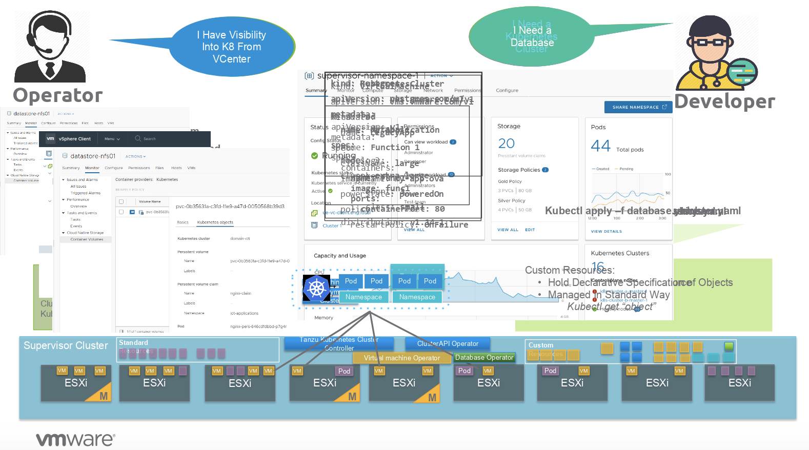

# Kubernetes on vSphere Lab

# Business Context:

### Vi Admin Persona:

### Developer's Persona:

# Steps:

### CLIs
###### kubectl
###### tmc
###### helm 3

## Installation

##### [1. Nested Install](./nestedInstall)

## Supervisor Cluster

##### [1. Enable Supervisor Cluster](./supervisorcluster/enablecluster)
##### [2. Enable Harbor](./supervisorcluster/enableharbor)
##### [3. Enable access control](./supervisorcluster/accesscontrol)
##### [4. Create namespace](./supervisorcluster/namespace)
##### [5. Deploy nativepod](./supervisorcluster/nativepod)
##### [6. Access Supervisor Cluster](./supervisorcluster/accesscluster)

## Service Cluster

##### [1. Create Service Cluster](./servicecluster/createservicecluster)
##### [2. Attach to TMC](./servicecluster/attachclustertotmc)
##### [3. Integrate Application Catalog](./servicecluster/integrateapplicationcatalog)
##### [4. Install Fluent Bit](./servicecluster/logging)
##### [5. Install Elastic Search and Kibana](./servicecluster/EK)
##### [6. Install Wavefront](./servicecluster/wavefront)

## Workload Cluster

##### [1. Create Work Cluster](./workloadcluster/createworkloadcluster)
##### [2. Attach to TMC](./workloadcluster/attachclustertotmc)
##### [3. Install Fluent Bit](./workloadcluster/logging)
##### [4. Install Wavefront](./workloadcluster/wavefront)
##### [5. Deploy word press](./workloadcluster/deployworkloads)